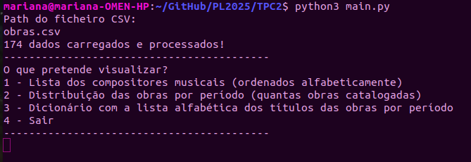
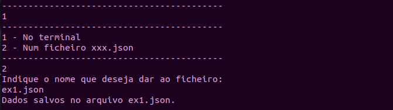
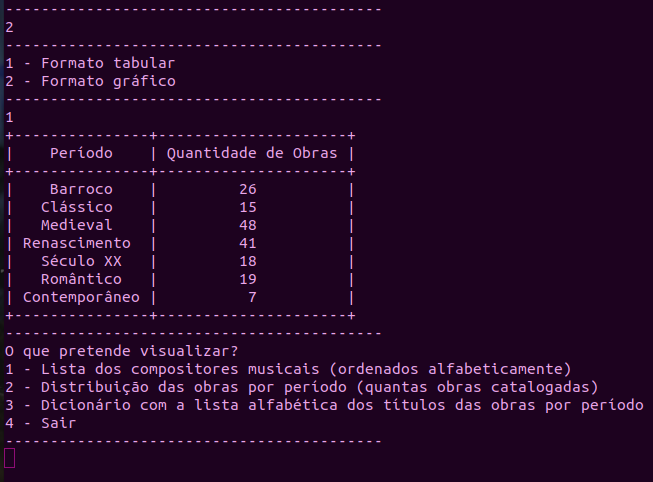
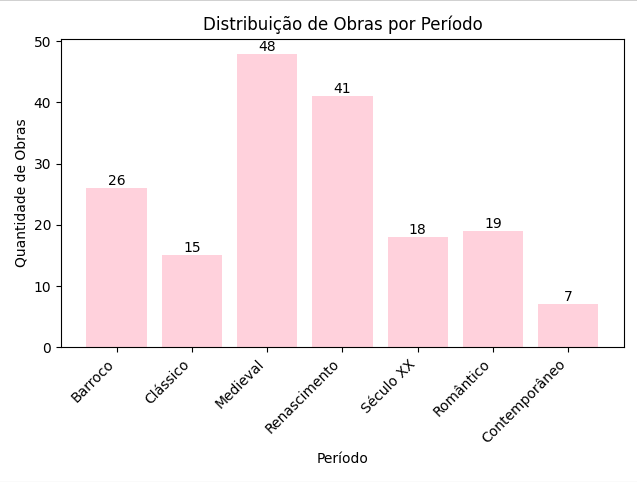
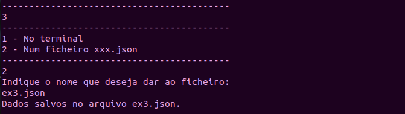
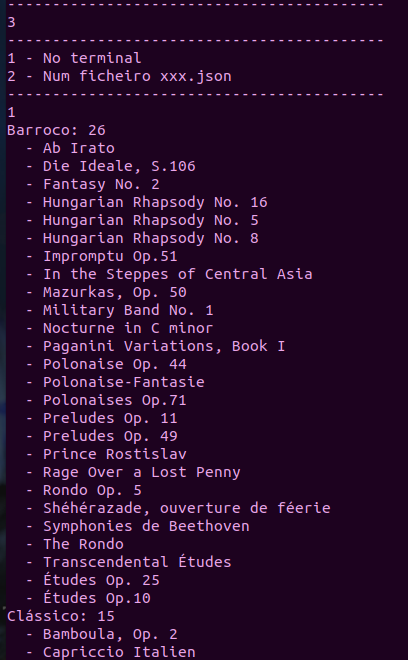

# TPC2: Análise e Processamento de Dados Musicais 🎵

## Autor 🌻
Mariana Rocha (A90817)

## Explicação 📋

Este projeto tem como objetivo processar um dataset de obras musicais (em formato CSV) e criar três resultados principais:

### 1. Lista de Compositores (Ordenada Alfabeticamente)
- Extrai nomes únicos de compositores do dataset.
- Formata nomes no pattern "Nome Apelido" (ex: `Krebs, Johann Ludwig` → `Johann Ludwig Krebs`).

### 2. Distribuição de Obras por Período
- Conta quantas obras existem em cada período (ex: Barroco, Clássico).
- Permite visualização em formato tabular ou gráfico.

### 3. Títulos por Período (Ordenados Alfabeticamente)
- Agrupa títulos de obras por período histórico.
- Exibe no terminal ou salva em JSON.

A solução não utiliza o módulo CSV do Python, conforme o enunciado.

## Raciocínio 🧩

### Estrutura do TPC

O TPC é composto pelos seguintes ficheiros:

1. **`main.py`**: Contém a lógica principal de processamento e interação com o utilizador.
2. **`musicalWork.py`**: Define a classe `MusicalWork` que representa os dados de uma obra musical.

### `musicalWork.py`

Define a classe `MusicalWork` para armazenar dados de cada obra:

- `title`: o título da obra;
- `description`: a descrição da obra;
- `year`: o ano da obra;
- `period`: o período em que a obra foi composta;
- `composer`: o compositor da obra;
- `duration`: a duração da obra;
- `id`: identificador único da obra.

### `main.py`

#### 1. **Função `read_csv`**

A função `read_csv` lê o arquivo CSV fornecido, limpa o conteúdo removendo quebras de linha e espaços extras. Cria um dicionário de objetos `MusicalWork`. Tudo com o auxílio de **regex**, explicado de seguida.

#### 2. **Função `composers`**

A função `composers` percorre todas as obras e extrai os nomes dos compositores, utilizando uma expressão regular para inverter a ordem do nome caso esteja no formato "Apelido, Nome". Os compositores são armazenados numa lista que é retornada ordenada e sem repetições.

#### 3. **Função `distribution_per_period`**

A função `distribution_per_period` organiza as obras por período (ex: Barroco, Clássico, etc.) e conta quantas obras existem em cada período. Esta também retorna os títulos das obras ordenados alfabeticamente.

#### 4. **Função `save_to_json`**

A função `save_to_json` guarda os dados num arquivo JSON.

#### 5. **Interface de Utilizador**

O programa oferece um menu interativo para o utilizador escolher as opções disponíveis. Dependendo da escolha, os resultados podem ser exibidos no terminal ou guardados num arquivo JSON.

### Expressões Regulares (Regex)

#### 1. Remoção de Quebras de Linha e Espaços Extras: **`r'\n\s+'`**

A expressão regular `r'\n\s+'` utilizada na linha:

<pre>
adjusted = re.sub(r'\n\s+', ' ', content)
</pre>

tem como objetivo remover quebras de linha seguidas de espaços em branco dentro do conteúdo do ficheiro CSV. A explicação do pattern é a seguinte:

- `\n`: Corresponde a uma quebra de linha.
- `\s+`: Corresponde a um ou mais espaços em branco (incluindo espaços, tabulações, etc.).

Essa substituição garante que o conteúdo do ficheiro seja tratado como uma única linha contínua, evitando problemas na separação dos campos ao processar os dados.

#### 2. Divisão dos Campos do CSV: **`r'(?:^|;)("(?:[^"]|"")*"|[^;]*)'`**

Esta expressão regular é usada para dividir os dados de cada linha do CSV em diferentes campos. Esta funciona da seguinte maneira:

- `(?:^|;)`: Um "non-capturing group" que procura pelo início da linha (`^`) ou por um ponto e vírgula (`;`).
- `"(?:[^"]|"")*"`: Captura campos entre aspas, incluindo aspas escapadas (`""`).
- `[^;]*`: Captura qualquer sequência de caracteres até o próximo ponto e vírgula, ou até o final da linha.

#### 3. Formatação de Nomes dos Compositores: **`p = r'(\w+),\s+(.+)'`**

Esta expressão regular é utilizada para inverter a ordem do nome do compositor, caso o nome se encontre no formato "Apelido, Nome".  Captura da seguinte forma:

- `(\w+)`: O primeiro grupo captura o apelido (uma sequência de caracteres alfanuméricos).
- `,\s+`: A vírgula e os espaços em branco entre o apelido e o nome.
- `(.+)`: O segundo grupo captura o nome (qualquer sequência de caracteres).

#### 4. **`re.sub(p, r'\2 \1', name)`**

Esta linha usa a função `re.sub` para substituir o nome no formato "Apelido, Nome" para "Nome Apelido", trocando os dois grupos capturados na expressão regular.

## Como Executar 🛠️

### Pré-Requisitos

Este projeto foi desenvolvido em Python e requer a instalação das seguintes bibliotecas:
- `matplotlib`: para criar gráficos.
- `tabulate`: para gerar tabelas formatadas.
- `json`: para salvar os resultados em arquivos JSON (utilizado nativamente no Python).
- `re`: para manipulação de expressões regulares.

Essas bibliotecas podem ser instalados via pip:

<pre>
pip3 install matplotlib tabulate
</pre>

### Como Usar

1. **Execute o programa**:
   - Abra o terminal e execute o arquivo `main.py` com o comando:
<pre>
$ python3 <a href="main.py">main.py</a>
</pre>

2. **Entradas**:
   - Insira o caminho do arquivo CSV (ex: `obras.csv`).

3. **Opções**:
   O programa oferece as seguintes opções para o utilizador:
   - **1**: Lista dos compositores musicais (ordenados alfabeticamente) -> Visualização no Terminal ou num ficheiro JSON.
   - **2**: Distribuição das obras por período (quantas obras catalogadas) -> -> Visualização tabelar ou graficamente.
   - **3**: Dicionário com a lista alfabética dos títulos das obras por período -> Visualização no Terminal ou num ficheiro JSON.
   - **4**: Sair do programa.

## Exemplos e Resultados 📊

**1. Compositores (ordenados alfabeticamente)**

Pode-se verificar os resultados desta pergunta no ficheiro <a href="ex1.json">ex1.json</a> e nas seguintes imagens:

**2. Distribuição das Obras por Período (quantidade de obras)**

Pode-se verificar os resultados desta pergunta nas seguintes imagens:

**3. Dicionário com Títulos por Período**

Pode-se verificar os resultados desta pergunta no ficheiro <a href="ex3.json">ex3.json</a> e nas seguintes imagens:

